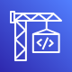

#  고현수 | Hans Ko

##  World Skills Korea - Cloud Computing ([info](https://meister.hrdkorea.or.kr/sub/3/2/1/20160512110924569100_view.do))

### 2021
| # | Mission | Services |
| ------------- | ------------- | ------------- |
| [Jibang Day 1](https://github.com/AWS-Skills/2021/tree/main/jibang/day1)  | IT Infrastructure |     |
| [Korea Day 1](https://github.com/AWS-Skills/2021/tree/main/korea/day1)  | Web Service Provisioning |     |
| [Korea Day 2](https://github.com/AWS-Skills/2021/tree/main/korea/day2)  | Automation |      |
| [Korea Day 3](https://github.com/AWS-Skills/2021/tree/main/korea/day3)  | Trouble Shooting |     |

### 2022
| # | Mission | Services |
| ------------- | ------------- | ------------- |
| [Jibang Day 1](https://github.com/AWS-Skills/2022/tree/main/jibang/day1) | Web Service Provisioning |     |
| [Jibang Day 2](https://github.com/AWS-Skills/2022/tree/main/jibang/day2) | Automation |     |
| [Korea Day 1](https://github.com/AWS-Skills/2022/tree/main/korea/day1)  | Web Service Provisioning |    |
| [Korea Day 2](https://github.com/AWS-Skills/2022/tree/main/korea/day2) | Automation |       |
| [Korea Day 3](https://github.com/AWS-Skills/2022/tree/main/korea/day3) | Trouble Shooting |   |

### 2023
| # | Mission | Services |
| ------------- | ------------- | ------------- |
| [Jibang Day 1](https://github.com/AWS-Skills/2023/tree/main/jibang/day1) | Web Service Provisioning |     |
| [Jibang Day 2](https://github.com/AWS-Skills/2023/tree/main/jibang/day2) | Automation |     |
| [Korea Day 1](https://github.com/AWS-Skills/2023/tree/main/korea/day1)  | Web Service Provisioning |       |
| [Korea Day 2](https://github.com/AWS-Skills/2023/tree/main/korea/day2) | Automation |       |
| [Korea Day 3](https://github.com/AWS-Skills/2023/tree/main/korea/day3) | Trouble Shooting |     |
 
### 2024
| # | Mission | Services |
| ------------- | ------------- | ------------- |
| [Jibang Day 1](https://github.com/AWS-Skills/2024/tree/main/jibang/day1) | Web Service Provisioning |      |
| [Jibang Day 2](https://github.com/AWS-Skills/2024/tree/main/jibang/day2) | Automation |       |
| [Korea Day 1](https://github.com/AWS-Skills/2024/tree/main/korea/day1) | | |
| [Korea Day 2](https://github.com/AWS-Skills/2024/tree/main/korea/day2) | | |
| [Korea Day 3](https://github.com/AWS-Skills/2024/tree/main/korea/day3) | | |
